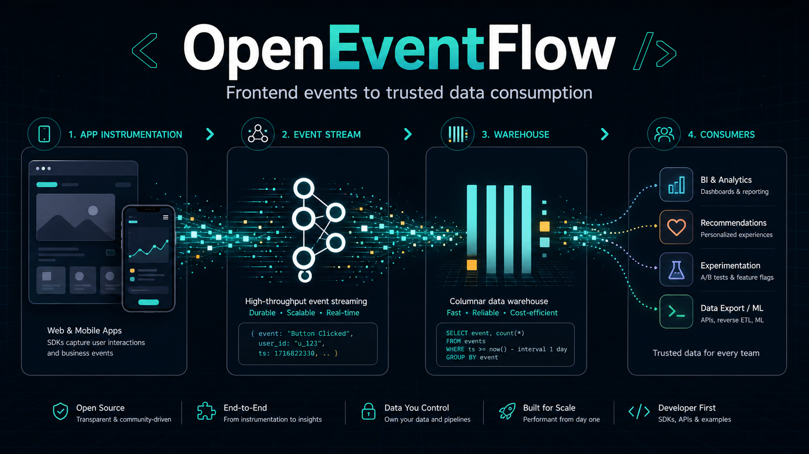

# OpenEventFlow

[中文 README](README.zh-CN.md)



OpenEventFlow is an open-source end-to-end event data pipeline for large apps. It connects frontend and mobile instrumentation with validated event streams, warehouse models, and downstream data consumption.

It gives product, growth, data, and engineering teams a contract-first way to collect user behavior from Web, React, React Native, Android, iOS, and Flutter apps, deliver those events into Kafka/Redpanda, model them in ClickHouse-style warehouse layers, and make the results reliable for BI, recommendations, ads, experimentation, and other consumers.

It is designed for teams that treat exposure, click, stay duration, add-to-cart, playback, watch duration, completion, like, and share events as production data contracts rather than loose client logs.

## Why OpenEventFlow

Most analytics SDKs optimize for dashboards. Large app teams often need something different:

- Stable event contracts that can be reviewed before release
- Multi-platform SDK APIs with the same event semantics
- Foreground-aware stay and watch duration tracking
- Schema validation and bad-event routing before data reaches the warehouse
- Kafka/Redpanda streams for downstream consumers
- ClickHouse warehouse models for ODS, DWD, fact, and ADS layers
- Local e2e tests that prove UI-triggered events match warehouse output

OpenEventFlow focuses on the full path from instrumentation to consumption. It can coexist with Snowplow, Segment/CDP tools, BI systems, recommendation systems, experimentation platforms, and internal data platforms.

## Design Philosophy

OpenEventFlow follows six design principles:

- **Contract first:** tracking plans are reviewed and versioned before SDK types and schemas are generated.
- **SDK as an infrastructure entry point:** SDKs collect, normalize, queue, and flush events; they do not own dashboards or business analysis.
- **Collector mediated:** clients send events to a collector, never directly to Kafka, Redpanda, or ClickHouse.
- **Lifecycle aware:** stay duration and watch duration exclude background or paused time.
- **Governed by default:** consent, identity, session, schema validation, and bad-event routing are first-class concerns.
- **Warehouse friendly:** event data lands in explicit ODS, DWD, fact, and ADS layers that downstream consumers can trust.

## Architecture

```text
Web / React / React Native / Android / iOS / Flutter app
  -> OpenEventFlow SDK
  -> OpenEventFlow Collector or Snowplow Collector
  -> Redpanda / Kafka topic
  -> schema validation / enrichment / bad-event routing
  -> recommendation attribution / realtime interest
  -> training samples / feature sink
  -> Warehouse loader
  -> ClickHouse ODS / DWD / fact / ADS tables
  -> BI / recommendations / ads / experimentation / data products
```

The SDK layer keeps app code stable. The collector and stream layer provide ingestion control. The warehouse layer turns behavior events into queryable, consumer-ready data.

## What Is Included

- Shared JavaScript analytics runtime for queueing, consent, identity, sessions, and flush control
- Web, React, and React Native SDK packages
- Android Kotlin, iOS Swift, and Flutter/Dart SDKs
- Tracking-plan CLI that generates JSON Schema, TypeScript, Kotlin, Swift, and Dart artifacts
- Tracking-plan compatibility checks for additive, deprecated, and breaking changes
- Collector with API-key authentication, health/readiness endpoints, bounded request bodies, awaited broker adapters, and bad-event routing
- Recommendation attribution core with deduplication, event-time windows, negative samples, refund corrections, and late-event routing
- Flink attribution and realtime-interest jobs with Kafka/Redpanda wiring, checkpoints, watermarks, state TTL, and an injectable feature sink
- Snowplow self-describing event adapter
- Warehouse loader and ClickHouse HTTP adapter
- ClickHouse DDL and dbt models for ODS, DWD, fact, and ADS layers
- Ecommerce e2e scenario: exposure, click, stay, add-to-cart
- Short-video feed e2e scenario: exposure, play, watch duration, completion, like, share
- Docker Compose templates for Redpanda and ClickHouse
- Kubernetes and Snowplow deployment templates

## Quick Start

Install dependencies:

```bash
npm install
```

Generate schemas and typed SDK event models:

```bash
npm run codegen
```

Run the standard verification suite:

```bash
npm run verify
```

Run real middleware smoke tests with Redpanda and ClickHouse:

```bash
docker compose -f deploy/docker/docker-compose.yml up -d
npm run smoke:docker
npm run smoke:docker:video
npm run smoke:dbt
```

Generated artifacts are written to `mobile/generated`.

## Repository Layout

```text
.github/                     GitHub workflows, issue templates, and PR template
deploy/                      Docker Compose, Kubernetes, and Snowplow templates
docs/                        Architecture, SDK, tracking, warehouse, and testing docs
e2e/                         Ecommerce and short-video app-to-warehouse e2e tests
examples/                    Example tracking plans and SDK usage snippets
mobile/generated/            Generated JSON schemas and typed mobile event models
packages/core/               Shared analytics runtime
packages/collector/          Collector, validation, topic publishing, HTTP server
packages/recommendation/     Recommendation attribution and interest domain logic
packages/snowplow-adapter/   Snowplow self-describing event adapter
packages/warehouse/          Warehouse loader and ClickHouse adapter
packages/web/                Browser SDK
packages/react/              React bindings
packages/react-native/       React Native bindings
sdks/android/                Android Kotlin SDK
sdks/ios/                    iOS Swift SDK
sdks/flutter/                Flutter/Dart SDK
tools/tracking-plan-cli/     Tracking-plan schema and code generator
streaming/flink-recommendation/ Flink attribution and realtime-interest jobs
warehouse/dbt/               dbt models for warehouse layers
```

See [docs/repository-structure.md](docs/repository-structure.md) for a detailed map.

## Example Event Flow

```text
User sees a video card
  -> video_exposed event
User starts playback
  -> video_played event
User watches foreground playback for 12.5 seconds
  -> video_watch event
User likes and shares the video
  -> video_engaged events
Collector validates the events
  -> Redpanda topic
Warehouse loader consumes the topic
  -> fact_video_* tables
ADS layer aggregates daily video behavior
```

The same pattern is used for ecommerce events such as product exposure, click, stay duration, and add-to-cart.

## Verification

The current suite covers:

- SDK queueing, consent, identity, session, and flush behavior
- Stay-duration foreground/background semantics
- Web lifecycle handling
- React and React Native bindings
- Native and Flutter SDK API contracts
- Tracking-plan code generation
- Tracking-plan compatibility checks
- Collector authentication, probes, request limits, broker acknowledgment, schema validation, and bad-event routing
- Recommendation attribution, correction, negative-sample, and interest-decay rules
- Flink recommendation module tests (`mvn -f streaming/flink-recommendation/pom.xml test`)
- Warehouse loading into ODS, DWD, fact, and ADS layers
- Ecommerce and short-video e2e consistency
- Real Redpanda and ClickHouse smoke tests

Useful commands:

```bash
npm test
npm run test:mobile
npm run smoke:dbt
npm run smoke:docker
npm run smoke:docker:video
```

## Documentation

- [Architecture](docs/architecture.md)
- [Design Principles](docs/design-principles.md)
- [Framework Support](docs/framework-support.md)
- [Mobile Engineering](docs/mobile-engineering.md)
- [Tracking Plan](docs/tracking-plan.md)
- [Schema Evolution](docs/schema-evolution.md)
- [Recommendation Pipeline](docs/recommendation-pipeline.md)
- [Stay Duration](docs/stay-duration.md)
- [Warehouse](docs/warehouse.md)
- [Local Pipeline](docs/local-pipeline.md)
- [Recommendation Pipeline](docs/recommendation-pipeline.md)
- [E2E Testing](docs/e2e-testing.md)
- [Roadmap](ROADMAP.md)

## Project Status

OpenEventFlow is at an open-source first-release stage. The repository includes contract generation and compatibility checks, hardened collector building blocks, recommendation attribution and interest logic, Flink job examples, warehouse models, deployment templates, and e2e verification. Persistent SDK queues, a concrete production Kafka adapter, OpenTelemetry dashboards, full privacy governance, and production operations remain follow-up work.

## Contributing

Contributions are welcome. Please read [CONTRIBUTING.md](CONTRIBUTING.md), [CODE_OF_CONDUCT.md](CODE_OF_CONDUCT.md), and [SECURITY.md](SECURITY.md) before opening issues or pull requests.

## License

Apache License 2.0. See [LICENSE](LICENSE).
